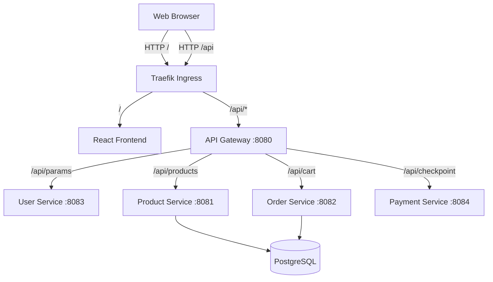

# Enterprise E-Commerce Microservices Demo

An enterprise-grade, scalable e-commerce application demonstrating a complete architecture migration from a monolithic backend to a fully distributed microservices architecture. It features a premium, responsive React storefront with dynamic routing, and a backend composed of 5 independent Spring Boot microservices deployed on Kubernetes.

## 🌟 Features

- **Microservices Architecture**: The backend logic is decoupled into 5 distinct Spring Boot APIs:
  - `api-gateway`: A Spring Cloud Gateway acting as the single entry point.
  - `user-service`: Manages merchant and user data.
  - `product-service`: Manages the product catalog (backed by PostgreSQL).
  - `order-service`: Handles shopping cart and checkout flows (backed by PostgreSQL).
  - `payment-service`: Simulates enterprise payment gateways.
- **Premium Frontend UI**: A modern React SPA (Single Page Application) built with Vite and React Router. It features a Nike/Puma-inspired aesthetic, utilizing high-quality Unsplash image assets rather than generic icons.
- **Containerized**: Every component is isolated within its own Docker container.
- **Kubernetes Native**: Fully declarative `k8s/` manifests including Deployments, Services, and a Traefik Ingress controller for routing traffic into the cluster.

## 🛠️ Tech Stack

- **Frontend**: React 18, Vite, React Router, Vanilla CSS, Lucide Icons.
- **Backend Services**: Java 17, Spring Boot 3.2, Spring Cloud Gateway, MapStruct, Spring Data JPA.
- **Database**: PostgreSQL 15.
- **DevOps/Infrastructure**: Docker, Kubernetes (k3s/k3d), Traefik Ingress.

## 🚀 Getting Started

### Prerequisites
- Docker Desktop
- `k3d` (for running the local Kubernetes cluster)
- `kubectl` (Kubernetes command-line tool)

### Installation & Deployment

1. **Start the local Kubernetes Cluster**:
   ```bash
   k3d cluster create startup-cluster -p "8080:80@loadbalancer"
   ```

2. **Build the Docker Images**:
   Build the frontend and all 5 backend microservices from the project root:
   ```bash
   docker build -t startupdemo/frontend:latest ./frontend
   docker build -t startupdemo/api-gateway:latest ./api-gateway
   docker build -t startupdemo/user-service:latest ./user-service
   docker build -t startupdemo/product-service:latest ./product-service
   docker build -t startupdemo/order-service:latest ./order-service
   docker build -t startupdemo/payment-service:latest ./payment-service
   ```

3. **Import Images into the Cluster**:
   ```bash
   k3d image import startupdemo/frontend:latest startupdemo/api-gateway:latest startupdemo/user-service:latest startupdemo/product-service:latest startupdemo/order-service:latest startupdemo/payment-service:latest -c startup-cluster
   ```

4. **Apply Kubernetes Manifests**:
   ```bash
   kubectl apply -f k8s/
   ```

5. **Access the Application**:
   Navigate to `http://localhost:8080` in your web browser. Traefik automatically handles the routing from the `startup-demo-ingress` specification directly to the microservices.
   - Root (`/`) points to the React frontend.
   - API calls (`/api/...`) flow through `api-gateway` to the inner services.

## 💡 Architecture Flow



## 📝 License
This project is for demonstration and educational purposes.
